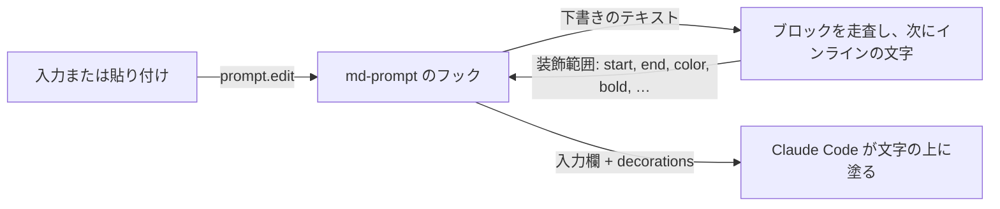

<div align="center">

# md-prompt

Claude Code の入力欄に、入力中の Markdown を装飾して表示します。コードブロックは、閉じフェンスを打つ前からシンタックスハイライト付きのカードになります。


[English](README.md)

</div>

## このフォークについて（shostako/md-prompt）

[nogu66/md-prompt](https://github.com/nogu66/md-prompt) を元に、VBA の塗り分けと、送信済みメッセージの描き直しを足したフォークです。元の機能はそのまま残っていて、追加は次の3つです。

- **```` ```vba ```` の色分け。** `vb` `vbs` `bas` `cls` `vb.net` なども同じ扱いです。
  - 色が付くもの: キーワード（大文字小文字を問わない）、`'` と `Rem` のコメント、文字列、数値（`&HFF` など）、`#2024/1/31#` の日付、`#If` などの条件付きコンパイル、行ラベル、`xlUp` や `vbCrLf` などの組み込み定数
  - `.` の後ろの語（`Debug.Print` や `rng.Select`）はメンバーとして扱い、キーワードの色にはしません
  - 文字列の中の `\` はただの文字です。`"C:\dir\"` は最後の `"` で閉じます
- **フェンス無しで打った VBA の自動判定。**
  - `Sub` `Function` `Property Get/Let/Set` で始まる見出し行から、対応する `End Sub` などの行までを VBA のコードカードとして塗ります
  - `End` の行を打つまでは塗りません（`**太字**` が閉じの `**` を待つのと同じです）
  - フェンスの中の行は対象外です。範囲内の `*` などは Markdown として解釈しません
  - `/md-prompt vba on | off | toggle` で切り替えます。`/config` の「VBA detection」でも変えられます（既定は on）
- **送信後の履歴も描き直し。**
  - コードブロック（または自動判定された VBA）を含む自分のメッセージを描き直します。地の文は Markdown として、コードは入力欄と同じ色分け（VBA 対応）で表示します
  - コードの色はこのプラグイン自身が塗ります。Claude Code の `syntaxHighlightingDisabled` で色分けを切っていても色が付きます
  - 変わるのは画面の表示だけです。保存されるメッセージとモデルに届く内容は、打ったままです
  - コードを含まないメッセージ、通知の行、1万文字を超えるメッセージは Claude Code の表示のままです
  - `/md-prompt history on | off | toggle` で切り替えます。`/config` の「Markdown in history」でも変えられます（既定は on）

インストールは次のとおりです。元の `md-prompt@nogu66` を入れている場合は、二重に塗られるので先に外してください。

```bash
claude plugin uninstall md-prompt@nogu66   # 入れている場合
claude plugin marketplace add shostako/md-prompt
claude plugin install md-prompt@shostako
```

Claude Code 2.1.287 以降では `CLAUDE_CODE_ENABLE_FUNCTION_HOOKS` は不要です（無視されます）。版ごとの変更は [CHANGELOG.ja.md](CHANGELOG.ja.md) にあります。このフォークは、元の作者が関与したり推奨したりしているものではありません。以下は元の README です。


## クイックスタート

1. `~/.claude/settings.json` で function hooks（early access）を有効にします。

   ```json
   { "env": { "CLAUDE_CODE_ENABLE_FUNCTION_HOOKS": "1" } }
   ```

2. シェル、またはセッション内でインストールします。

   ```bash
   claude plugin marketplace add nogu66/md-prompt
   claude plugin install md-prompt@nogu66
   ```

   ```
   /plugin marketplace add nogu66/md-prompt
   /plugin install md-prompt@nogu66
   ```

   インストール時に `1 userConfig option not yet set` と表示されることがありますが、何もする必要はありません。モードの既定値は `on` で、あとから `/md-prompt` か `/config` で変えられます。

3. 新しいセッションを開始して、入力欄に打ち込みます。複数行の下書きは `\` + Enter（端末が対応していれば Shift+Enter）で改行します。

   ````
   ```ts
   const answer: number = 42 // 打つそばから色が付く
   ```
   ````

**塗るだけです。** フックは下書きの文字に色を付けられますが、書き換えることはできません。入力したテキストも、モデルへ送られる内容も、打った文字そのままです。`**` や ` ``` ` といったマーカーは消えず、薄く表示されます。

## 何が塗られるか


| 入力 | 表示 |
| --- | --- |
| ` ```ts … ``` `、`~~~`、インデントコード | 背景色を固定したカードと、シンタックスの色。開始フェンスから、閉じる前でも塗られます。リストや引用の中のフェンスにも効きます |
| `` `code` `` | チップ表示 |
| `**太字**` `*斜体*` `***両方***` `~~取り消し~~` | 文字を装飾し、マーカーは薄くします。CommonMark の規則で、入れ子や段落内の複数行にも効きます |
| `- 項目` `* 項目` `1. 項目`（入れ子も可） | 記号に色と太字を付け、本文はそのままにします |
| `- [ ]` `- [x]`、行頭記号なしで行の先頭に書いた `[ ]` `[x]` | チェックボックスは、未完了なら琥珀色、完了なら緑にします |
| `> 引用`、`>> 入れ子` | 記号を灰色に、本文を斜体にします。引用の中のリストやフェンスにも効きます |
| `# H1` から `###### H6`、setext、末尾の `#` | 記号は薄く。H1 は太字と下線、H2 は太字、H3 は太字斜体、H4 は素のまま、H5 は斜体、H6 は薄い斜体 |
| `---` `***` `___` | 薄く表示します |
| 表 | ヘッダは太字、パイプと区切り行は薄く、セルの中のインライン記法はそのまま効きます |
| `[text](url "title")`、`[text][ref]` と `[ref]: url`、`<https://…>`、裸の URL、``、`[^1]` | 文字に下線と色、URL と括弧は薄くします |
| `<b>`、`<!-- コメント -->`、`&amp;` | タグとエンティティに色、コメントは薄い斜体 |

Markdown に見えるだけの文は、素のままです（`2*3*4`、`src/*.ts`、`__init__`、`Array<string>`、`arr[i][j]`、`snake_case_name`、`$5`、`~/path`）。参照リンクと脚注は、下書きの中に定義があるときだけ塗ります。


コードの色分けに対応するのは、`js` `jsx` `ts` `tsx`、`py`、`sh` `bash` `zsh`、`json`、`yaml`、`toml` `ini` `.env`、`go`、`rust`、`swift`、C 系と Java 系（`java` `kotlin` `c` `cpp` `cs` `php` `dart` `scala` `objc` `groovy`）、`sql`、`ruby`、`lua`、`hcl` `terraform`、`powershell`、`graphql`、`elixir`、`haskell`、`zig`、`r`、`perl`、`nginx`、`proto`、`html` `xml` `svg` `vue` `svelte`、`css` `scss` `less`、`markdown`、`dockerfile`、`makefile`、`diff`（追加行・削除行・ハンク行）です。それ以外の言語や言語指定なしでは、文字列と数値だけを色分けします。当て推量で地の文をコメント色にしないためです。

**色について。** コードは前景色と背景色を固定したカードの上に乗るので、どのテーマでも読めます。端末の背景に直接乗る少数の色（見出し、リンク、リスト記号、タスクのチェックボックス、タグ）は中間の明るさで、白背景で 3.3:1、暗い端末で 4.3:1 以上のコントラストをテストで保っています。マーカーはエンジンの薄字を使います。色を変えるときは [`palette.ts`](plugins/md-prompt/hooks/lib/palette.ts) の `PALETTE` を編集してください。

## コマンド

| コマンド | |
| --- | --- |
| `/md-prompt on` | すべて塗ります（既定） |
| `/md-prompt code` | コードブロックとインラインコードだけ塗ります |
| `/md-prompt off` | 入力欄をプレーンなままにします |
| `/md-prompt toggle` | off と on を切り替えます |
| `/md-prompt` | 現在のモードを表示します |

モードはプラグインの **Markdown painting** 設定で、`/config` に行があります（"Markdown" で検索）。そこからも変更できます。設定はセッションをまたいで保存され、`/md-prompt <モード>` はその行を書き換えて、すぐに反映します。

## 仕組み

<details>
<summary>キー入力から色が付くまで</summary>



Claude Code の function hooks は、プラグインのコードを CLI のプロセスの中で実行します。md-prompt は `prompt.edit`（編集や貼り付けのたびに、その結果の下書きとともに発火）と、プラグインによる下書きの書き込みを表す `prompt.fill` にフックします。

フックはテキストを純関数に渡して装飾範囲（`{ start, end, color, bold, … }`、UTF-16 コード単位のオフセット）を受け取り、変更していないテキストとカーソルに添えて `decorations` として返します。塗るのはエンジンです。入力欄そのものを描き直す手段はないので、マーカーが消えないのはそのためです。

処理は、読む対象ごとに分かれています。ブロックの走査は、CommonMark と同じ流儀で下書きを1行ずつ読みます。引用とリスト項目は入れ子になり、フェンスは閉じフェンスまで（入力中なら下書きの末尾まで）続くコードブロックを開き、見出し・表・区切り線は自分の記号を塗ります。段落、見出し、表のセルの文字は、そのあとインラインの走査を1回通ります。コードスパン、エスケープ、オートリンク、HTML が先で、次にリンク、最後に CommonMark のフランキング規則による強調です。フェンスの中身は、言語別の小さなトークナイザに渡します。どの段階も下書きの長さに対して線形で、インラインとブロックの走査は、ランダムなインライン 540 件とドキュメント 500 件で commonmark.js と一致することをテストしています（期待値は一度だけ生成し、`tests/fixtures` に置いています）。

| ファイル | 役割 |
| --- | --- |
| [`hooks/register.tsx`](plugins/md-prompt/hooks/register.tsx) | `prompt.edit`、`prompt.fill`、`/md-prompt` コマンド、モードの設定をつなぐ |
| [`hooks/lib/mdprompt.ts`](plugins/md-prompt/hooks/lib/mdprompt.ts) | 純関数: 下書き → 装飾範囲。入口 |
| [`hooks/lib/blocks.ts`](plugins/md-prompt/hooks/lib/blocks.ts) | 純関数: 行の構造、引用・リスト・フェンス・見出し・表 |
| [`hooks/lib/inline.ts`](plugins/md-prompt/hooks/lib/inline.ts) | 純関数: 段落の中、コードスパン・強調・リンク・HTML |
| [`hooks/lib/highlight.ts`](plugins/md-prompt/hooks/lib/highlight.ts) | 純関数: コード＋言語 → トークン範囲（と言語別の補助） |
| [`hooks/lib/palette.ts`](plugins/md-prompt/hooks/lib/palette.ts) | 色と、装飾範囲の型 |
| [`hooks/lib/mode.ts`](plugins/md-prompt/hooks/lib/mode.ts) | 純関数: モードと `/md-prompt` の引数 |

</details>

## トラブルシューティング

**何も塗られず、`/md-prompt` が未知のコマンドになる。** Claude Code は、信頼済みのワークスペースでしかプラグインのフックを読み込みません。読み込まなかったときも、何も表示しません。`claude --debug-file /tmp/cc.log` で起動し、ログに `hooks modules not loaded until workspace trust is accepted: md-prompt` が出ていないか探してください。すでに信頼しているディレクトリから起動するか、そのディレクトリの信頼確認を承認します。作ったばかりのディレクトリや `git init` したばかりのディレクトリで特に起きやすい問題です。

## 制約

<details>
<summary>既知の制約</summary>

- function hooks は early access で、Claude Code のリリース間で API が変わる可能性があります。動作確認は 2.1.285 です。
- カードの背景は文字の下にしか付きません。行末までは伸びず、ブロック内の空行は塗る文字がないので、カードの右端がギザギザになり、空行の位置で切れます。文字を書き換えずに行を埋める手段がフックにはありません。
- 4 行以上の貼り付けは装飾されません。Claude Code が `[Pasted text #N +M lines]` に畳み、編集イベントが発火しないためです。1〜3 行の貼り付けは装飾されます。展開したあとに1文字打つか、貼り付けずに打ち込んでください。
- 履歴からの呼び出し（↑キー）は未確認です。検証中に呼び出せた履歴に Markdown 記号入りの項目がありませんでした。
- 塗らないもの: 数式（`$…$`）、YAML の front matter、`> [!NOTE]` 形式の注記、強制改行、複数行にまたがるリンク定義とタイトル、コメント以外の HTML ブロック（`<div>` の中身も Markdown として塗ります）。HTML のコードブロックでは、埋め込みの `<script>` と `<style>` は色分けしません。コードブロックの中の Markdown は装飾しません。
- 地の文が塗られないよう、CommonMark からあえてずらしています。単語の文字どうしの間や `/` の直後の `*` は強調を開きません。Python の `__init__` は太字にしません。setext 見出しは、文末が句読点でない1行だけです。単語に密着した未知のタグ（`Array<string>`）はタグにしません。
- CommonMark と同じく、引用のすぐ下にある `>` のない行も引用に属します（斜体になります）。空行で終わります。
- 色は、コントラスト比で選び、暗い端末での目視と、同じ装飾範囲を白と明るい灰の背景に描画した画像での目視で確認しました。実際の明るい端末では確認していません。
- 薄字は、端末の faint 属性ではなく、エンジンが灰色の色として描画します。
- 60,000 文字を超える下書きは装飾しません。

</details>

## 開発

```bash
claude --plugin-dir plugins/md-prompt     # このチェックアウトを読み込む。保存すると再読み込み（bun run dev でも可）
bun test tests                            # 純ロジックのテスト（bun run test でも可）
claude plugin test plugins/md-prompt      # フックのテスト。エンジンのテスト用ホストで動く（bun run test:hooks でも可）
claude plugin validate .                  # マーケットプレイス
claude plugin validate plugins/md-prompt  # プラグイン: どのイベントにフックし、どの `$` を呼ぶか
tsc -p plugins/md-prompt                  # 型チェック（bun run typecheck でも可）
```

プラグインをセッションで読み込むと（`claude --plugin-dir plugins/md-prompt`、ヘッドレスなら `claude -p "/cost" --plugin-dir plugins/md-prompt`）、使っている Claude Code ビルドの型定義と `tsconfig.json` が、プラグインの隣に書き出されます。`tsc` にはこれが必要で、`bun run typecheck` は両方を実行します。`validate` と `test` は書き出しません。導入済みのコピーはバージョンが変わったときだけ更新されるので、リリースのたびに `plugins/md-prompt/.claude-plugin/plugin.json` のバージョンを上げてください。

## ライセンス

[MIT](LICENSE)
