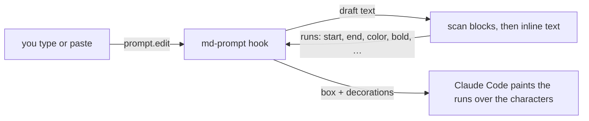

<div align="center">

# md-prompt

Markdown, painted onto Claude Code's prompt box as you type. Fenced code becomes a syntax-highlighted card before you even close the fence.


[日本語](README.ja.md)

</div>

## About this fork (shostako/md-prompt)

A fork of [nogu66/md-prompt](https://github.com/nogu66/md-prompt) that adds VBA painting. Everything the original does is kept; this fork adds three things:

- **Highlighting for ```` ```vba ```` fences.** `vb` `vbs` `bas` `cls` `vb.net` and similar names are treated the same.
  - Coloured: keywords (in any case), `'` and `Rem` comments, strings, numbers (`&HFF` and the like), `#2024/1/31#` dates, `#If` and other conditional compilation lines, line labels, and built-in constants such as `xlUp` and `vbCrLf`
  - A word after `.` (`Debug.Print`, `rng.Select`) is a member, so it never gets the keyword colour
  - A `\` inside a string is just a character: `"C:\dir\"` closes at its last `"`
- **VBA typed without a fence is detected.**
  - From a header line starting with `Sub`, `Function` or `Property Get/Let/Set` to its matching `End Sub` (or `End Function`, `End Property`) line, the procedure is painted as a VBA code card
  - Nothing is painted until the `End` line is typed, the way `**bold**` waits for its closing `**`
  - Lines inside a fence never count, and a `*` inside the procedure is never read as Markdown
  - Switch it with `/md-prompt vba on | off | toggle`, or the "VBA detection" row in `/config` (on by default)
- **Your sent messages are drawn again in the transcript.**
  - A message of your own that holds a code block (or a detected VBA procedure) is redrawn: prose as Markdown, code in the same colours as the prompt box, VBA included
  - The code is coloured by this plugin itself, so it stays coloured even if you turned Claude Code's highlighting off with `syntaxHighlightingDisabled`
  - Only the drawing changes. The stored message, and what the model reads, stay exactly as you typed them
  - Messages without code, notification rows, and messages over 10,000 characters keep Claude Code's own drawing
  - Switch it with `/md-prompt history on | off | toggle`, or the "Markdown in history" row in `/config` (on by default)

To install this fork, remove the original `md-prompt@nogu66` first if you have it, since both would paint the same text twice:

```bash
claude plugin uninstall md-prompt@nogu66   # if installed
claude plugin marketplace add shostako/md-prompt
claude plugin install md-prompt@shostako
```

From Claude Code 2.1.287 on, `CLAUDE_CODE_ENABLE_FUNCTION_HOOKS` is no longer needed (it is ignored). This fork is not affiliated with or endorsed by the original author. The original README follows.

## Quick start

1. Turn on function hooks (early access) in `~/.claude/settings.json`:

   ```json
   { "env": { "CLAUDE_CODE_ENABLE_FUNCTION_HOOKS": "1" } }
   ```

2. Install, from your shell or inside a session:

   ```bash
   claude plugin marketplace add nogu66/md-prompt
   claude plugin install md-prompt@nogu66
   ```

   ```
   /plugin marketplace add nogu66/md-prompt
   /plugin install md-prompt@nogu66
   ```

   The installer may say `1 userConfig option not yet set`. There is nothing to do: the mode defaults to `on`, and you can change it later with `/md-prompt` or in `/config`.

3. Start a new session and type into the prompt box. A multi-line draft starts with `\` + Enter (or Shift+Enter where your terminal supports it):

   ````
   ```ts
   const answer: number = 42 // painted as you type
   ```
   ````

**Paint only.** A hook can colour the characters of the draft but not change them, so what you type, and what is sent to the model, is exactly what you typed. The Markdown markers (`**`, ` ``` `) stay visible; they are dimmed instead of hidden.

## What it paints


| You type | You see |
| --- | --- |
| ` ```ts … ``` `, `~~~`, indented code | A card with a fixed background and syntax colours, from the opening fence on, closed or not. Fences work inside lists and quotes |
| `` `code` `` | A chip |
| `**bold**` `*italic*` `***both***` `~~strike~~` | The text styled, the markers dimmed. CommonMark's rules: nested, across the lines of a paragraph |
| `- item` `* item` `1. item` (nested) | The marker coloured and bold, the text as typed |
| `- [ ]` `- [x]`, or `[ ]` `[x]` opening a line with no bullet | The box amber while open, green when done |
| `> quote`, `>> nested` | The marker greyed, the text italic; lists and fences inside a quote work |
| `# H1` to `###### H6`, setext, closing `#`s | The marker dimmed. H1 bold and underlined, H2 bold, H3 bold italic, H4 plain, H5 italic, H6 faint italic |
| `---` `***` `___` | Dimmed |
| Tables | Header bold, the pipes and delimiter row dimmed, cells keep their inline styles |
| `[text](url "title")`, `[text][ref]` with `[ref]: url`, `<https://…>`, bare URLs, ``, `[^1]` | The text underlined and coloured, the URL and brackets dimmed |
| `<b>`, `<!-- comment -->`, `&amp;` | Tags and entities coloured, comments dim italic |

Things that only look like Markdown stay plain: `2*3*4`, `src/*.ts`, `__init__`, `Array<string>`, `arr[i][j]`, `snake_case_name`, `$5`, `~/path`. A reference link or footnote is painted only when the draft defines it.


Code is highlighted for `js` `jsx` `ts` `tsx`, `py`, `sh` `bash` `zsh`, `json`, `yaml`, `toml` `ini` `.env`, `go`, `rust`, `swift`, the C and Java families (`java` `kotlin` `c` `cpp` `cs` `php` `dart` `scala` `objc` `groovy`), `sql`, `ruby`, `lua`, `hcl` `terraform`, `powershell`, `graphql`, `elixir`, `haskell`, `zig`, `r`, `perl`, `nginx`, `proto`, `html` `xml` `svg` `vue` `svelte`, `css` `scss` `less`, `markdown`, `dockerfile`, `makefile` and `diff` (added, removed and hunk lines). Any other or missing language gets strings and numbers only, so a guess never turns prose into a comment.

**Colours.** Code sits on a card with fixed foreground and background colours, so it reads on any theme. The few colours that sit straight on your terminal background (headings, links, list markers, task boxes, tags) are mid-tones with at least 3.3:1 contrast on white and 4.3:1 on a dark terminal, held by a test; markers use the engine's dim. To change any of them, edit `PALETTE` in [`palette.ts`](plugins/md-prompt/hooks/lib/palette.ts).

## Commands

| Command | |
| --- | --- |
| `/md-prompt on` | Paint everything (the default) |
| `/md-prompt code` | Paint only fenced code and inline code |
| `/md-prompt off` | Leave the prompt box as plain text |
| `/md-prompt toggle` | Switch between off and on |
| `/md-prompt` | Show the current mode |

The mode is the plugin's **Markdown painting** setting, a row in `/config` (search for "Markdown"), so you can change it there too. It is kept across sessions, and `/md-prompt <mode>` writes that row and applies at once.

## How it works

<details>
<summary>From a keystroke to a colour</summary>



Claude Code's function hooks run a plugin's code inside the CLI process. md-prompt hooks `prompt.edit`, which fires on every edit or paste with the draft the edit produced, and `prompt.fill`, for a plugin writing the draft.

The hook hands the text to a pure function, gets back style runs (`{ start, end, color, bold, … }`, offsets in UTF-16 code units), and returns them beside the unchanged text and cursor as `decorations`. The engine does the painting. There is no way to redraw the prompt box itself, which is why the markers stay visible.

The work is split by what it reads. A block pass reads the draft line by line the way CommonMark does: quotes and list items nest, a fence opens a code block that runs to the closing fence (or to the end of the draft while you are still typing), and headings, tables and rules paint their own chrome. The text of every paragraph, heading and table cell then goes through one inline pass: code spans, escapes, autolinks and HTML first, then links, then emphasis by CommonMark's flanking rules. A fence body goes to a small per-language tokenizer. Every step is linear in the length of the draft, and the inline and block passes must agree with commonmark.js on 540 random inline strings and 500 random documents (the expectations are generated once and kept in `tests/fixtures`).

| File | Role |
| --- | --- |
| [`hooks/register.tsx`](plugins/md-prompt/hooks/register.tsx) | Wires `prompt.edit`, `prompt.fill`, the `/md-prompt` command and the mode setting |
| [`hooks/lib/mdprompt.ts`](plugins/md-prompt/hooks/lib/mdprompt.ts) | Pure: draft text to style runs, the entry point |
| [`hooks/lib/blocks.ts`](plugins/md-prompt/hooks/lib/blocks.ts) | Pure: line structure, quotes, lists, fences, headings, tables |
| [`hooks/lib/inline.ts`](plugins/md-prompt/hooks/lib/inline.ts) | Pure: inside a paragraph, code spans, emphasis, links, HTML |
| [`hooks/lib/highlight.ts`](plugins/md-prompt/hooks/lib/highlight.ts) | Pure: code and language to token spans (and its per-language helpers) |
| [`hooks/lib/palette.ts`](plugins/md-prompt/hooks/lib/palette.ts) | The colours and the shape of a style run |
| [`hooks/lib/mode.ts`](plugins/md-prompt/hooks/lib/mode.ts) | Pure: the modes and the `/md-prompt` arguments |

</details>

## Troubleshooting

**Nothing is painted, and `/md-prompt` says it is an unknown command.** Claude Code loads a plugin's hooks module only in a workspace you have trusted, and stays silent when it does not. Run `claude --debug-file /tmp/cc.log`, then look for `hooks modules not loaded until workspace trust is accepted: md-prompt` in the log. Start Claude Code from a directory you have already trusted, or accept the trust prompt for this one. This bites most often in a freshly created or freshly `git init`ed directory.

## Limitations

<details>
<summary>Known limits</summary>

- Function hooks are early access, and their API may change between Claude Code releases. Tested on 2.1.285.
- The card background covers the characters only. It does not run to the end of the line, and a blank line inside a block has no characters to paint, so the card is ragged and has gaps there. A hook cannot pad a line without changing your text.
- A paste of 4 or more lines is not painted. Claude Code folds it into `[Pasted text #N +M lines]` and never fires the edit event; pastes of 1 to 3 lines are painted. Type a character after expanding it, or type the block instead.
- Recalling a prompt from history (Up arrow) is unconfirmed: the recalled entries in testing held no Markdown to paint.
- Not painted: math (`$…$`), YAML front matter, `> [!NOTE]` callouts, hard line breaks, link definitions and titles that span lines, and HTML blocks other than comments (the inside of a `<div>` is still painted as Markdown). HTML code blocks do not highlight embedded `<script>` or `<style>`. Markdown inside a code block is left alone.
- It departs from CommonMark on purpose, so prose stays plain: a `*` between two word characters or right after `/` never opens emphasis, Python's `__init__` is not bold, a setext heading is a single line not ending like a sentence, and an unknown tag glued to a word (`Array<string>`) is not a tag.
- As in CommonMark, a line right under a quote with no `>` still belongs to the quote (so it is italic) until a blank line ends it.
- Colours were chosen by contrast ratio, and checked by eye on a dark terminal and on a rendering of the same runs over white and light grey, not on a real light terminal.
- Dim is drawn by the engine as a grey colour, not the terminal's faint attribute.
- A draft over 60,000 characters is left unpainted.

</details>

## Development

```bash
claude --plugin-dir plugins/md-prompt     # load this checkout; saving reloads it (or: bun run dev)
bun test tests                            # the pure logic (or: bun run test)
claude plugin test plugins/md-prompt      # the hooks, in the engine's test host (or: bun run test:hooks)
claude plugin validate .                  # the marketplace
claude plugin validate plugins/md-prompt  # the plugin: which events it hooks, which `$` calls it makes
tsc -p plugins/md-prompt                  # type-check (or: bun run typecheck)
```

Loading the plugin in a session (`claude --plugin-dir plugins/md-prompt`, or `claude -p "/cost" --plugin-dir plugins/md-prompt` for a headless run) writes the type declarations of your Claude Code build and a `tsconfig.json` next to the plugin; `tsc` needs them, and `bun run typecheck` does both. `validate` and `test` do not write them. Bump the version in `plugins/md-prompt/.claude-plugin/plugin.json` with each release, since installed copies update only when it changes.

## License

[MIT](LICENSE)
